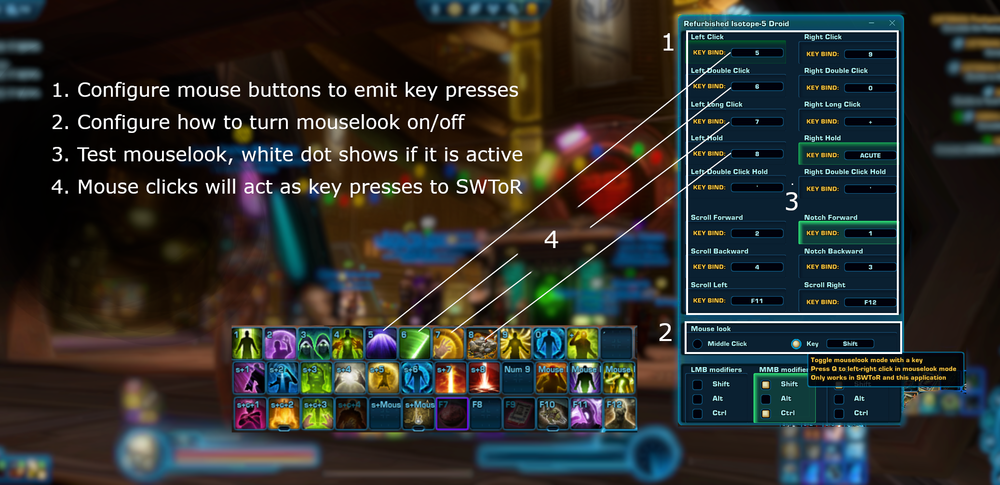

SWToR Mouse Droid
======================

Description
-----------
A *Star Wars: The Old Republic* mouselook application with configurable click binds

Download
--------
[zip](https://github.com/alignedalignof/swtormousedroid/archive/refs/heads/master.zip)
[exe](https://github.com/alignedalignof/swtormousedroid/raw/master/swtormousedroid5.exe)
[source](https://github.com/alignedalignof/swtormousedroid/archive/refs/heads/dev.zip)

Usage
-----
Launch the graphical user interface to configure click-key binding, mouselook toggle, and modifiers.
See tooltips for more info.
Mouselook can be activated within the app or SWToR.

